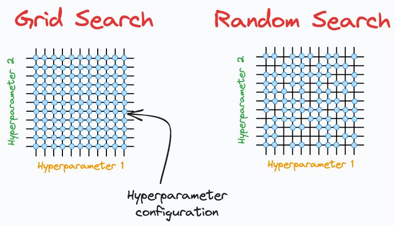

# Cat task 000 :D
## Theoretical Questions:
### Explain what eigenvalues and eigenvectors are. How are they applied in Principal Component Analysis (PCA)?
- **Eigenvectors** are special vectors that do not change direction during transformation, they stretch or squashed
- **Eigenvalues** are scalar values that represent how much the corresponding eigenvector was stretched or squashed
- **PCA**: technique used to reduce the dimensionality of data while keeping the same meaning as posible 
### What is the difference between Grid Search and Random Search in hyperparameter tuning?

- **Grid Search**: learning technique for hyperparameter tuning, for finding the best settings/hyperparameters for the model by trying every combination from predefined values, training a model for each, and selecting the set with the best performance, can be very computationally expensive.
- **Random Search**: randomly sampling combinations from a defined range, rather than checking every single one like grid search, with a defined number of iterations to stop, can give better performance at lower computational cost.
### What is the difference between correlation and causation? Why is it important to distinguish them?
- **Correlation**: Statistical measure that describes the size and direction of a relationship between two variables
- **Causation**: Indicates that one event is the result of the occurrence of the other event
- Why distinguish? Simply cuz Mistaking correlation for causation leads to incorrect decisions
### How can we evaluate the performance of classification and regression models? Mention key metrics for each.
- **Classification**
    - F1-score
    - Accuracy
    - Precision
- **Regression**
    - MAE
    - MSE
    - RMSE
    - R^2
### Explain Gradient Descent. How does it work to minimize a loss function, and what are the differences between Batch, Stochastic, and Mini-batch Gradient Descent?
- **Gradient Descent**: Type of optimization algorithm used to minimize Loss Function, By calc the slope of the loss function then adjusting the parameters, and repeating
- **Batch**: Uses entire dataset to calculate the gradient for a single step.
- **Mini-Batch**: Uses a small batch (e.g., 32 or 64 samples) for a step.
- **Stochastic**: Uses single random sample to calculate the gradient for a step.

## Kaggle Life expectancy Task
- First i will inspect the dataset, i will try to eyeball it to get some context
- Then i will use `.isnull()` to find any missing data
- I will use Imputation Strategy, any null data for contries i will fill it with avg value per country from 2000 to 2015
- Goal is to predict Life Expectancy Column, So any null entries ==> i will drop them, we can't teach the model wrong values :D
- For traing i will use Random Split `80/20`, which will provide Better understanding for general factors, like what if some big event happened in between the years, a clean split will lose this context
- After traing/evaulation i will merge the split to get further preformance
- I will encode some features to 0/1 like `Developing` vs `Developed`
- I will run a quick `LinearRegression` to get a base score
- I will use XGBoost to make the model :)
- I will make initial guess about which features are useless to drop them Like countries names? i will use `SHAP` plots to get a general idea
## Check `LFED.ipynb` for the Solution


## SQL Problems:
### Select all movies with odd ID and Description !== Boring
```sql
SELECT id, movie, description, rating FROM Cinema WHERE id % 2 = 1 AND description <> 'boring' ORDER BY rating DESC;
```
### Count times each student attended an Exam, Sort by ID
i will combine duplicates in Examinations table first
```sql
WITH ExamCounts AS (
    SELECT student_id, subject_name, COUNT(*) AS attended_exams FROM Examinations
    GROUP BY student_id, subject_name
)
```
then map the IDs to student names while filling 0 for missing exams
```sql
SELECT s.student_id, s.student_name, sub.subject_name, COALESCE(ec.attended_exams, 0) AS attended_exams FROM Students s
CROSS JOIN Subjects sub
LEFT JOIN ExamCounts ec
    ON s.student_id = ec.student_id AND sub.subject_name = ec.subject_name
ORDER BY
    s.student_id, sub.subject_name;
```
## Problem Solving:
### Problem 1
```py
import sys

def solve():
    # read all stdin for inputs
    input_data = sys.stdin.read().split()
    
    if not input_data:
        return

    iterator = iter(input_data)
    num_test_cases = int(next(iterator))

    results = []

    for _ in range(num_test_cases):
        n = int(next(iterator))
        k = int(next(iterator))
        s = next(iterator)

        def check(length):
            ops_needed = 0
            i = 0
            while i < n:
                if s[i] == '0':
                    i += 1
                else:
                    # Found a light that is ON
                    ops_needed += 1
                    # We cover this light and the next L-1 lights
                    # So we skip L positions forward
                    i += length
            
            return ops_needed <= k

        # Binary Search for the answer
        low = 1
        high = n
        ans = n

        while low <= high:
            mid = (low + high) // 2
            if check(mid):
                ans = mid
                high = mid - 1 # Try to find a smaller working L
            else:
                low = mid + 1

        results.append(str(ans))

    print('\n'.join(results))

if __name__ == '__main__':
    solve()
```
### Problem 2
```py
import sys

def solve():
    input_data = sys.stdin.read().split()
    
    if not input_data:
        return

    iterator = iter(input_data)
    
    n = int(next(iterator))
    
    v = [int(next(iterator)) for _ in range(n)]
    
    u = sorted(v)
    
    pref_v = [0] * (n + 1)
    for i in range(n):
        pref_v[i+1] = pref_v[i] + v[i]
        
    pref_u = [0] * (n + 1)
    for i in range(n):
        pref_u[i+1] = pref_u[i] + u[i]
        
    m = int(next(iterator))
    results = []
    
    for _ in range(m):
        type_q = int(next(iterator))
        l = int(next(iterator))
        r = int(next(iterator))
        
        # Calculate range sum using the formula: P[r] - P[l-1]
        if type_q == 1:
            ans = pref_v[r] - pref_v[l-1]
        else:
            ans = pref_u[r] - pref_u[l-1]
            
        results.append(str(ans))
        
    # Print all results separated by newlines
    print('\n'.join(results))

if __name__ == '__main__':
    solve()
```